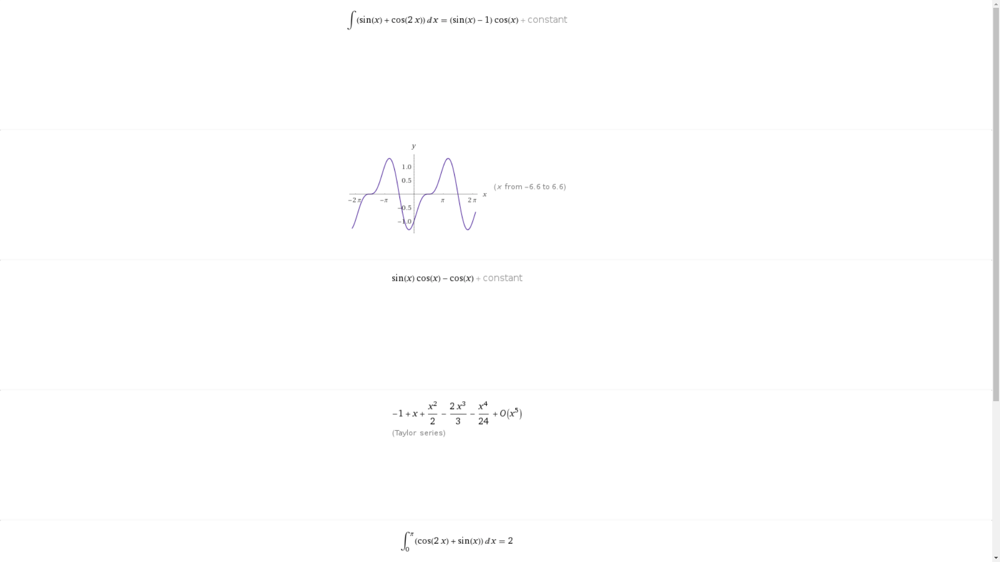

# An intelligent learing application using node js and React js 

This is a educational app which can solve, search almost anything(History,Math,politics,geography...)


A request to solve a random math problem 

SOlution to the problem


## how to run ?
First clone or download the project then run following commands 
```
$ npm install
$ node index.js
```
Open another terminal 
```
$ cd wolfui
$ npm install
$ npm run start
```
### Don't forget to replace IO_URL (wolfui/src/componentswith your home network IP.
